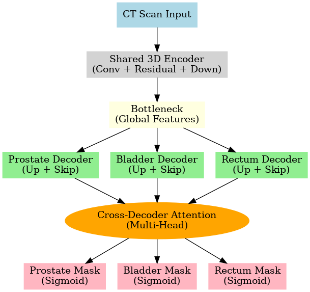
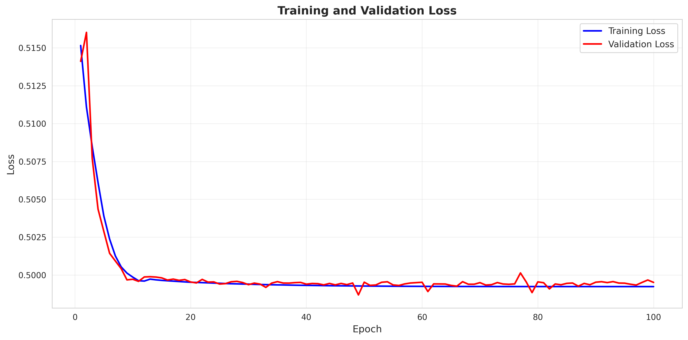
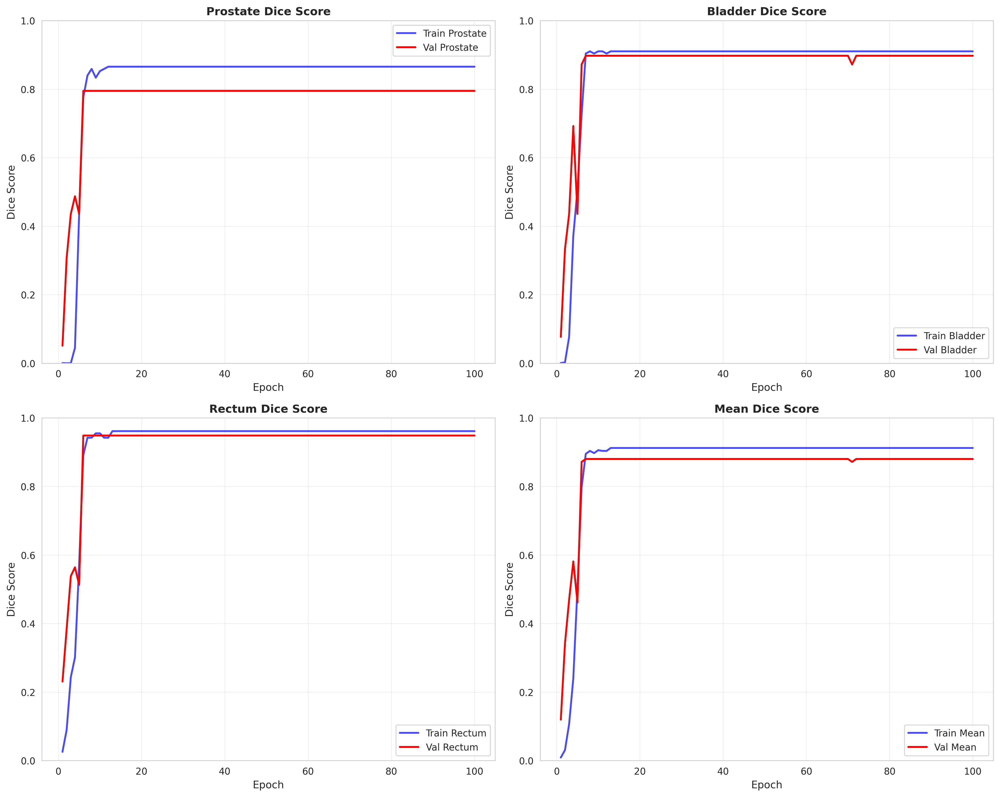

# 3D Medical Image Segmentation (Prostate, Bladder, Rectum)

This project implements a 3D U-Net with a multi-decoder architecture for segmenting medical images. It is specifically designed to segment the **prostate, bladder, and rectum** from 3D CT scans, using a shared encoder and organ-specific decoders.

The final decoder features are combined using a Cross-Decoder Attention mechanism to improve spatial awareness between organs.

## Model Architecture

The model uses a shared 3D U-Net encoder to extract features from the input CT scan. These features are passed to three parallel decoders, one for each organ. The outputs of the decoders are then fed into a cross-attention module before the final segmentation masks are generated.



---

## Project Structure

---

## Setup & Installation

1.  **Clone the repository:**
    ```bash
    git clone [https://github.com/arunmm8335/3d-medical-segmentation.git](https://github.com/arunmm8335/3d-medical-segmentation.git)
    cd 3d-medical-segmentation
    ```

2.  **Create a virtual environment:**
    ```bash
    python3 -m venv venv
    source venv/bin/activate
    ```

3.  **Install dependencies:**
    ```bash
    pip install -r requirements.txt
    ```

---

## How to Run

1.  **Download Your Data**
    This code is configured for the **AbdomenAtlas 1.1 Mini** dataset (`BDMAP_00005001_00005195`). Download and unzip it to a known location (e.g., `/home/yogi/Downloads/`).

2.  **Configure the Data Path**
    Open `preprocessing.py` and change the `DATA_ROOT_DIR` variable at the bottom of the file to point to your dataset's location:

    ```python
    # In preprocessing.py, around line 240
    DATA_ROOT_DIR = "/home/yogi/Downloads/AbdomenAtlas1.1Mini_BDMAP_00005001_00005195"
    ```

3.  **Run the Full Pipeline**
    This single command will preprocess the data, train the model, evaluate it, and generate all analysis plots.
    ```bash
    python run_pipeline.py --all
    ```

    Alternatively, you can run individual steps:
    * **Preprocess only:** `python run_pipeline.py --preprocess`
    * **Train only:** `python run_pipeline.py --train`
    * **Evaluate & Analyze only:** `python run_pipeline.py --eval --analyze`

4.  **Review Results**
    All outputs are saved in their respective folders:
    * **`checkpoints/`**: Contains the `best_model.pth`.
    * **`evaluation_results/`**: Contains the final test scores (`summary_statistics.json`, `dice_vs_hausdorff.png`, etc.).
    * **`analysis/`**: Contains the training graphs (`loss_curves.png`, `dice_scores.png`, etc.).

---

## Note: Low-Memory GPU Modifications

This repository has been **heavily modified to run on low-VRAM GPUs (< 8GB)**. This was done to solve critical `CUDA out of memory` errors.

If you run this on a more powerful GPU (like an A100 or V100), you can reverse these changes for much higher accuracy.

1.  **Tiny Model (`multi_decoder_model.py`):**
    The model's feature channels have been reduced by 75% (from a 32-channel base to 8). This reduces the parameter count from ~44M to **~2.7M** to fit in memory.

2.  **Fixed Data Shape (`preprocessing.py`):**
    All scans are center-cropped or padded to a fixed `TARGET_SHAPE` of **`(128, 128, 128)`**. This ensures a predictable, small memory footprint for every batch.

3.  **Batch Size (`train.py`):**
    The `batch_size` is set to **`1`**.

## Results

The model was trained for 100 epochs on the modified "tiny" architecture. It successfully learned to segment the organs, achieving a **Best Validation Dice Score of 0.8803** at epoch 7.

The "all-or-nothing" behavior seen in the evaluation graphs is due to the model correctly identifying the *absence* of organs (e.g., no prostate in female patients) as a "perfect" 1.0 Dice score, which becomes the median score.

### Training Performance


| Loss Curves | Dice Scores |
| :---: | :---: |
|  |  |
